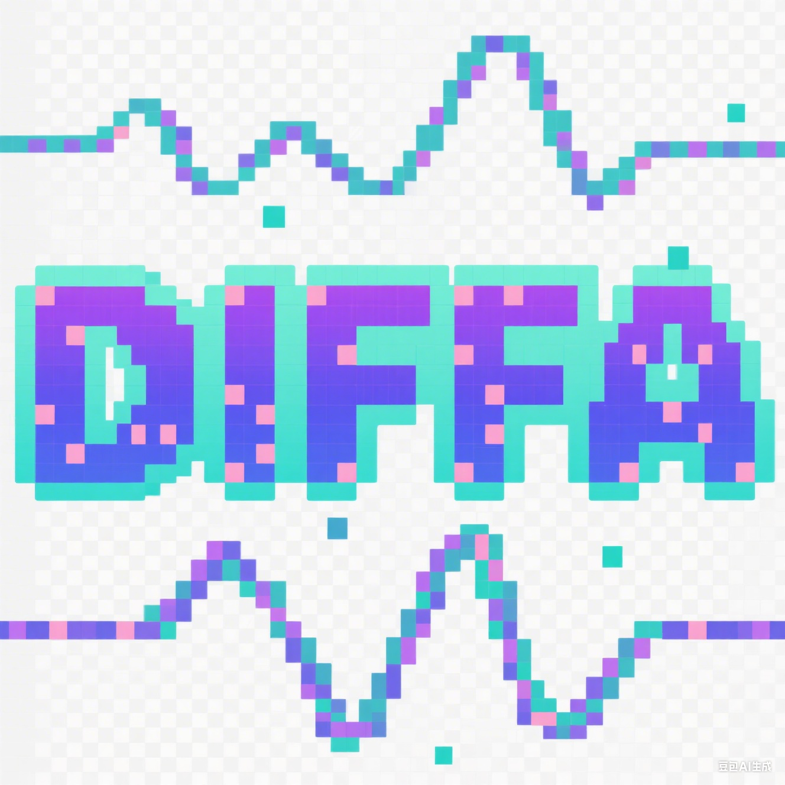

#   DIFFA Series
## 🔥 News
- **2026.03.03**:  Released the **DIFFA-2** [checkpoint](https://huggingface.co/zhoujiaming777/DIFFA-2) and code.
- **2026.01**: Our new paper **DIFFA-2** is now available on [arXiv](https://arxiv.org/abs/2601.23161v1). 🎉
- **2025.11**: **DIFFA** has been accepted to **AAAI 2026**!
- **2025.08**: Released the **DIFFA** [checkpoint](https://huggingface.co/zhoujiaming777/DIFFA) and code.
- **2025.07**: Our paper **DIFFA** is available on [arXiv](https://arxiv.org/abs/2507.18452). 🎉


# DIFFA-2: A Practical Diffusion Large Language Model for General Audio Understanding

[](https://arxiv.org/abs/2601.23161v1)
[](https://huggingface.co/zhoujiaming777/DIFFA-2)
[](https://github.com/NKU-HLT/DIFFA)

 In this paper, We introduce DIFFA-2, a practical diffusion-based LALM for general audio understanding. DIFFA-2 upgrades the speech encoder, employs dual semantic and acoustic adapters, and is trained with a four-stage curriculum that combines semantic and acoustic alignment, large-scale supervised fine-tuning, and variance-reduced preference optimization, using only fully open-source corpora. Experiments on MMSU, MMAU, and MMAR show that DIFFA-2 consistently improves over DIFFA and is competitive to strong AR LALMs under practical training budgets, supporting diffusion-based modeling is a viable backbone for large-scale audio understanding.

# DIFFA: Large Language Diffusion Models Can Listen and Understand

[](https://arxiv.org/abs/2507.18452)
[](https://huggingface.co/zhoujiaming777/DIFFA)
[](https://github.com/NKU-HLT/DIFFA)

---

**DIFFA** is the **first diffusion-based large audio-language model (LALM)** for spoken language understanding.  
It leverages a frozen diffusion LLM with **dual adapters** (semantic + acoustic) to enhance **audio perception and reasoning**.  
As the first exploration of diffusion-based large language models (dLLMs) in speech and audio understanding, DIFFA opens new directions for non-autoregressive multimodal learning.
This repository provides the training data, checkpoints, inference scripts, and reproducible training pipelines to facilitate further research on diffusion LLMs in the audio domain.


## 📖 Citation

If you find DIFFA useful, please cite:

```bibtex

@article{zhou2026diffa,
  title={DIFFA-2: A Practical Diffusion Large Language Model for General Audio Understanding},
  author={Zhou, Jiaming and Cheng, Xuxin and Zhao, Shiwan and Jia, Yuhang and Liu, Cao and Zeng, Ke and Cai, Xunliang and Qin, Yong},
  journal={arXiv preprint arXiv:2601.23161},
  year={2026}
}

@article{zhou2025diffa,
  title={DIFFA: Large Language Diffusion Models Can Listen and Understand},
  author={Zhou, Jiaming and Chen, Hongjie and Zhao, Shiwan and Kang, Jian and Li, Jie and Wang, Enzhi and Guo, Yujie and Sun, Haoqin and Wang, Hui and Kong, Aobo and others},
  journal={arXiv preprint arXiv:2507.18452},
  year={2025}
}
```